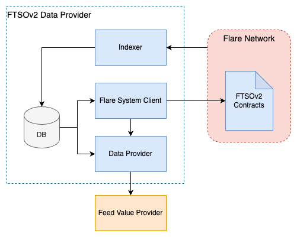

# FTSO V2 Overview



A data provider system for FTSOv2 consists of the following components:

1. **Flare System Client**. Responsible for all interactions with the FTSOv2 smart contracts, including data collection and submission, voter registration, and additional system tasks.
2. **Data Provider**. Provides commit, reveal, and median result data to System Client for submission.
3. **Feed Value Provider**. Provides current values (prices) for a given set of feeds.
4. **Indexer**. Monitors the blockchain and records all FTSOv2 related transactions and events.
5. **Fast Updates Client**. Responsible for interaction with Fast Updates contracts, including data collection and submission and other system tasks.

Reference implementations are provided for **Indexer**, **Flare System Client**, **Data Provider**, **Fast Updats Client**, and providers are expected to plug in their own **Feed Value Provider** implementing a specific REST API (there is an sample implementation for testing).

## Operation

The following is a very simplified description of a single voting round operation.

**System Client** runs a scheduler which triggers voting actions every round (90s):
- On voting round start, obtain reveal data for the previous round from **Data Provider** and send to `Submission` smart contract.
- Once the reveal deadline passes (45s), obtain median result Merkle root from **Data Provider**, sign, and send to `Submission` smart contract. 
- Before the end of the voting round, obtain a feed value commit hash for the current round from the **Data Provider** (which will get processed in the following round).
- There is finalizer process which monitors the indexer database for signature transactions, and once enough signature weight for a voting round is gathered, submits the set of signatures to the `Relay` smart contract. If signature verification passes, the voting round is considered finalized. The `Relay` contract is the authoritative storage of confirmed voting round result Merkle roots.

Additionally, once in a reward epoch the **System Client** triggers voter registration, which allows participating in the following reward epoch.

**Data Provider** obtains all commit and reveal data straight from encoded transaction calldata recorded in the indexer database. All calls to `Submission` contract are simply empty function invocations, with the actual submission data provided as additional calldata on the transaction.

# Deployment

## Register accounts

Note: Account registration is required for FTSOv2 participation and must be done before starting any further deployment steps.

Each data provider in the FTSOv2 system must set up and register the following 5 accounts:

- `Identity`. Main identity account of the voter. On mainnets this should be held in cold storage, it's required for initial data provider setup but not used during each round on voting.
- `Submit`. Used for sending commit and reveal transactions.
- `SubmitSignatures`. Used for sending voting round result signature transactions. (To avoid nonce conflicts, **System Client** uses multiple accounts for submitting transactions).
- `SigningPolicy`. Used for signature generation during the voting round, and reward epoch signing policy signing (it's a system protocol ran once during reward epoch to establish reward epoch settings, including valid voters and their weights).
- `Delegation`. Account to which community should delegate funds (using WNat contract) to increase the vote power of the voter (identity/entity) - and also to later get the rewards. If not set, the identity account will be used.

Accounts need to be funded for gas fees. The delegation account is used of establishing voter power, which can be achieved by wrapping funds directly or by delegation from other accounts. Wrapping can be done via the [development portal](https://governance.dev.aflabs.org/) (make sure to pick the correct network for testnets and via [portal](https://portal.flare.network) for mainnets. 

Important: protocol operation uses normalized weights, and the delegation account should have <span style="color:red">at least 150 WCFLR</span> to obtain a non-0 vote power.

Account registration is handled by the `EntityManager` smart contract, which can be accessed:
- for [Coston](https://coston-explorer.flare.network/address/0x60A848E5Da796D741e559c170E851FC813061217/write-contract#address-tabs).
- for [Songbird](https://songbird-explorer.flare.network/address/0x46C417D0760198E94fee455CE0e223262a3D0049/write-contract#address-tabs).

The required contract invocation steps can be found in this [deployment task](https://github.com/flare-foundation/flare-smart-contracts-v2/blob/main/deployment/tasks/register-entities.ts#L33). You can check out the smart contract repo and run the task itself, or register accounts manually via the explorer UI link above. (It only needs to be done once).

Additionally for fast updates:
- Sortition key has to be generated (you can read more [here](https://github.com/flare-foundation/fast-updates/tree/main/go-client)). You can generate it using:
```
docker run --rm ghcr.io/flare-foundation/fast-updates/go-client:latest keygen
```
- Accounts for submission need to be generated and funded for gas prices. These can be any accounts not used for the 5 accounts above and don't need to be regsitered with the system in any way. We suggest using three to avoid nonce conflicts. You will need to pass their private keys in the `.env` file separated by commas.

Instructions for the Hardhat deployment task:
- Check out repo: https://github.com/flare-foundation/flare-smart-contracts-v2/
- Build repo: `yarn` then `yarn c`
- Create a JSON file with account keys:
```
[
  {
    "identity": {
      "address": "0xca84d6086c5b32212a0cf1638803355d7be31482",
      "privateKey": "<private key hex>"
    },
    "submit": {
      "address": "0x7961de7ad159106a79187379a22d21c1e5a924db",
      "privateKey": "<private key hex>"
    },
    "submitSignatures": {
      "address": "0x7570c09c17f79aa50bab7ba385c0d5ca12c5b4d3",
      "privateKey": "<private key hex>"
    },
    "signingPolicy": {
      "address": "0x9ffa9cf5f677e925b6ecacbf66caefd7e1b9883a",
      "privateKey": "<private key hex>"
    },
    "delegation": {
      "address": "0x95288e962ff1893ef6c32ad4143fffb12e1eb15f",
      "privateKey": "<private key hex>"
    }
    "sortitionPrivateKey": "<private key hex>"
  }
]
```
- Set the following env vars in `.env`:
```
ENTITIES_FILE_PATH="<path to account keys JSON>"

# if coston
COSTON_RPC=rpctocoston
CHAIN_CONFIG="coston"

# if songbird
SONGBIRD_RPC=rpctosongbird
CHAIN_CONFIG="songbird"

# if coston2
COSTON2_RPC=rpctocoston2
CHAIN_CONFIG="coston2"
```
**Note 1: do not use .env.template, instead just create .env using above example or running tasks will error**

**Note 2: do not use public rpc because you will get rate limited during the task**

- Run tasks:
```
# if coston
yarn hardhat --network coston register-entities
yarn hardhat --network coston register-public-keys

# if songbird
yarn hardhat --network songbird register-entities

# if coston2
yarn hardhat --network coston2 register-entities
```

## Install dependencies and setup .env

You will need:
- [jq](https://jqlang.github.io/jq/)
    - `brew install jq`
    - `apt-get install jq`
    - `pacman -S jq`
- [envsubst](https://www.gnu.org/software/gettext/manual/html_node/envsubst-Invocation.html)
    - (macOS only) `brew install gettext`
- [docker](https://www.docker.com/)
- [bash] (macOs only for updated version) `brew install bash`

Setup `.env`:
- Use `.env.example` to create `.env` file, eg.: using `cp .env.example .env`
- Set private keys for required accounts in the `.env` file.
- Set `NODE_RPC_URL` and `NODE_API_KEY` (optional) with your Coston or Songbird node RPC endpoint in the `.env` file. 
- Set `VALUE_PROVIDER_URL` to the endpoint of your feed value provider. Leave default if using example provider below
- Set `FAST_UPDATES_ACCOUNTS` to private keys of fast updates submission accounts separated by commas
- Set `FAST_UPDATES_SORTITION_PRIVATE_KEY` to the key that was registered with the network

Populate configs for provider stack by running `./populate_config.sh`. **NOTE: You'll need to rerun this command if you change your `.env` file.**

## Start provider stack
Since docker-compose.yaml is provided you can start everything with `docker compose up -d`
and stop everything with `docker compose down`. Database is persisted in a named docker volume. 
If you need to wipe database you need to remove the volume manually. When codebase is changed 
new images need to be pulled with `docker compose pull`

## Feed value provider

Start your own feed value provider or alternatively use example provider:
```bash
docker run --rm -it \
  --publish "0.0.0.0:3101:3101" \
  --network "ftso-v2-deployment_default" \
  ghcr.io/flare-foundation/ftso-v2-example-value-provider
```

Once the container is running, you can find the API spec at: http://localhost:3101/api-doc.

Note: some users reported issues with getting the provider to start. For initial testing a "fixed" value provider can be used that simply returns a constant instead of reading data from exchanges. It can be started by setting an extra env variable `VALUE_PROVIDER_IMPL=fixed`:
```bash
docker run --rm -it \
  --env VALUE_PROVIDER_IMPL=fixed \
  --publish "0.0.0.0:3101:3101" \
  --network "ftso-v2-deployment_default" \
  ghcr.io/flare-foundation/ftso-v2-example-value-provider
```

You should see the following in the logs:
```
WARN [FixedFeed] Initializing FixedFeed, will return 0.01 for all feeds.
```

## How do I know it's working

You will see various errors initially on `ftso-scaling` and `flare-system-client`, since the data provider will not be registered as a voter for the current reward epoch. There is a time window for voter registration on every reward epoch, and if you leave things running you should eventually see `RegisterVoter success` logged by `flare-system-client`. It should then start submitting data successfully in the *following* reward epoch.

Here are log samples indicating successful operation (`flare-system-client`):
```
[03-04|06:58:20.000]	DEBUG	protocol/submitter.go:142	submitter submit1 running epoch 567838
[03-04|06:58:20.000]	DEBUG	protocol/submitter.go:143	  epoch is [2024-03-04 06:57:00 +0000 UTC, 2024-03-04 06:58:30 +0000 UTC], now is 2024-03-04 06:58:20.000923016 +0000 UTC m=+234317.457953448
[03-04|06:58:20.001]	DEBUG	protocol/protocol_utils.go:55	Calling protocol client API: http://ftso-scaling-00:3100/submit1/567838/0x5579C824e5550ae24ceFe41B129472c3EC70be5c
[03-04|06:58:20.081]	DEBUG	chain/tx_utils.go:120	Sending signed tx: 0xd4e677859190afca0c5f287e735b959ced12d8f5107bcb14cc31add09cbc92ec
[03-04|06:58:20.212]	DEBUG	chain/tx_utils.go:128	Waiting for tx to be mined...
[03-04|06:58:22.244]	DEBUG	chain/tx_utils.go:134	Tx mined, getting receipt 0xd4e677859190afca0c5f287e735b959ced12d8f5107bcb14cc31add09cbc92ec
[03-04|06:58:22.271]	DEBUG	chain/tx_utils.go:139	Receipt status: 1
[03-04|06:58:22.272]	INFO	protocol/submitter.go:78	submitter submit1 submitted tx
[03-04|06:58:35.001]	DEBUG	protocol/submitter.go:142	submitter submit2 running epoch 567839
[03-04|06:58:35.001]	DEBUG	protocol/submitter.go:143	  epoch is [2024-03-04 06:58:30 +0000 UTC, 2024-03-04 07:00:00 +0000 UTC], now is 2024-03-04 06:58:35.001392224 +0000 UTC m=+234332.458422666
[03-04|06:58:35.001]	DEBUG	protocol/protocol_utils.go:55	Calling protocol client API: http://ftso-scaling-00:3100/submit2/567838/0x5579C824e5550ae24ceFe41B129472c3EC70be5c
[03-04|06:58:35.074]	DEBUG	chain/tx_utils.go:120	Sending signed tx: 0x56fe0f0d60b876122ea13d2ae902c4ad777f26d3e2d44c19742d7fb0a1ae25af
[03-04|06:58:35.197]	DEBUG	chain/tx_utils.go:128	Waiting for tx to be mined...
[03-04|06:58:37.241]	DEBUG	chain/tx_utils.go:134	Tx mined, getting receipt 0x56fe0f0d60b876122ea13d2ae902c4ad777f26d3e2d44c19742d7fb0a1ae25af
[03-04|06:58:37.274]	DEBUG	chain/tx_utils.go:139	Receipt status: 1
[03-04|06:58:37.274]	INFO	protocol/submitter.go:78	submitter submit2 submitted tx
[03-04|06:59:20.000]	DEBUG	protocol/submitter.go:208	signatureSubmitter submitSignatures running epoch 567839
[03-04|06:59:20.003]	DEBUG	protocol/submitter.go:209	  epoch is [2024-03-04 06:58:30 +0000 UTC, 2024-03-04 07:00:00 +0000 UTC], now is 2024-03-04 06:59:20.003337094 +0000 UTC m=+234377.460367537
[03-04|06:59:20.003]	DEBUG	protocol/protocol_utils.go:55	Calling protocol client API: http://ftso-scaling-00:3100/submitSignatures/567838/0x6Bc692221B1feff64218eF6Fb3D1D2cE077a64D3
[03-04|06:59:20.502]	DEBUG	chain/tx_utils.go:120	Sending signed tx: 0xb371cae856bf1f37f52f9db556a346d0de35e2b02b73f87ec2dad63f044d7e8a
[03-04|06:59:20.532]	DEBUG	chain/tx_utils.go:128	Waiting for tx to be mined...
[03-04|06:59:21.564]	DEBUG	chain/tx_utils.go:134	Tx mined, getting receipt 0xb371cae856bf1f37f52f9db556a346d0de35e2b02b73f87ec2dad63f044d7e8a
[03-04|06:59:21.604]	DEBUG	chain/tx_utils.go:139	Receipt status: 1
```

Here are log samples indicating successful operation (`fast-updates`):

**Note: depending on your weight it may take some time until you are selected for the fast-updates**
```
ftso-v2-deployment-fast-updates  | [04-25|09:00:32.456] INFO    provider/feed_provider.go:65    deltas: +++++++++++++++++++++-++++0+
ftso-v2-deployment-fast-updates  | [04-25|09:00:32.456] INFO    client/client_requests.go:205   submitting update for block 14266248 replicate 0: +++++++++++++++++++++-++++0+
ftso-v2-deployment-fast-updates  | [04-25|09:00:33.496] INFO    client/client_requests.go:239   successful update for block 14266248 replicate 0 in block 14266250
```
